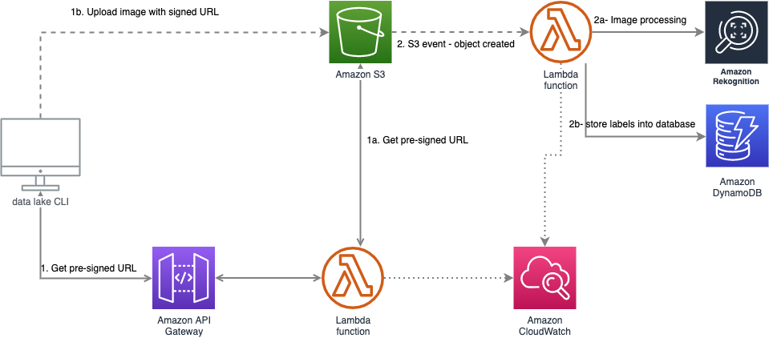

# ⚡ Cat Detector 🐱
[](http://www.serverless.com)
[](https://www.python.org/)


> This project demonstrates how to add observability to a fully serverless application using the aws-lambda-powertools python library. This article on the wescale blog allows to understand how to use this library.

## Overview
This project exposes an API to upload an image to an S3 bucket. The AWS Rekognition service then analyzes this image to produce labels that will be stored in a DynamoDB table.
The user can then query the database to find out if a cat has been detected on the uploaded image.

**It is an improved version of the project [image-recognition-api](https://github.com/kfrawee/image-recognition-api) by**
- Applying code best practice.
- Applying better project structure.
- Applying better logging and error handling.

<br>
<p align="center">

<b>Architecture diagram</b>
</p>

---
## **Prerequisites:**
>The following elements needs to be created before deploying lambda:
>
>- API Gateway
>- S3 Bucket
>- DynamoDB Tables

Their ARN and name must be stored into System Manager Parameter Store with the following paths
- /dev/cat-detector/bucket/name
- /dev/cat-detector/bucket/arn
- /dev/cat-detector/dynamodb/images/name
- /dev/cat-detector/dynamodb/images/arn
- /dev/cat-detector/apigw/id

> This project uses [`serverless`](https://www.serverless.com/) framework ⚡. So, make sure you get that first and give the necessary permissions to `serverless cli`. Follow [this page](https://www.serverless.com/framework/docs/getting-started/) for getting started. <br>

## **Usage:**


- Clone the repository:
    ```sh
    $ git clone https://github.com/ddrugeon/cat-detector.git
    ```

- Navigate to the directory:
    ```sh
    $ cd .\cat-detector\
    ```

- Deploy the stack:
  ```sh
    $ serverless deploy
  ```

## License

[MIT](https://choosealicense.com/licenses/mit/)
